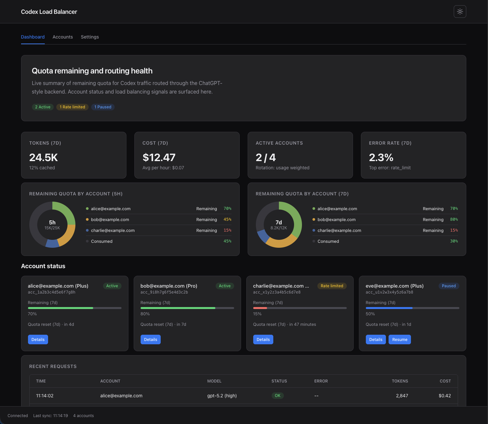
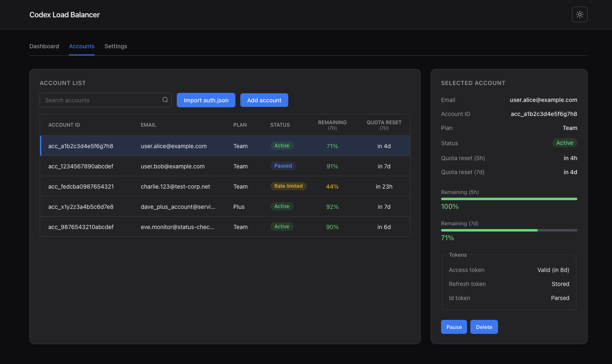

<!--
About
Codex/ChatGPT account load balancer & proxy with usage tracking, dashboard, and OpenCode-compatible endpoints

Topics
python oauth sqlalchemy dashboard load-balancer openai rate-limit api-proxy codex fastapi usage-tracking chatgpt opencode

Resources
-->

# codex-lb

Load balancer for ChatGPT accounts. Pool multiple accounts, track usage, view everything in a dashboard.

## Screenshots

### Main Dashboard View



### Accounts View



## Quick Start

### Docker

```bash
docker run -d --name codex-lb \
  -p 2455:2455 -p 1455:1455 \
  -v ~/.codex-lb:/var/lib/codex-lb \
  ghcr.io/soju06/codex-lb:latest
```

### uvx

```bash
uvx codex-lb
```

Open [localhost:2455](http://localhost:2455) → Add account → Done.

## Codex CLI & Extension Setup

Add to `~/.codex/config.toml`:

```toml
model = "gpt-5.2-codex"
model_reasoning_effort = "xhigh"
model_provider = "codex-lb"

[model_providers.codex-lb]
name = "OpenAI"  # MUST be "OpenAI" - enables /compact endpoint
base_url = "http://127.0.0.1:2455/backend-api/codex"
wire_api = "responses"
chatgpt_base_url = "http://127.0.0.1:2455"
requires_openai_auth = true  # Required: enables model selection in Codex IDE extension
```

## OpenCode Setup

Run:

```bash
opencode auth login
```

Then select `OpenAI` -> `Manually enter API Key` and enter any value.

Add the following to `~/.config/opencode/opencode.json`:

```jsonc
{
  ...
  "provider": {
    "openai": {
      "options": {
        "baseURL": "http://127.0.0.1:2455/v1"
      }
    },
    ...
  }
}
```

## Data

Data storage locations:

- Local/uvx: `~/.codex-lb/`
- Docker: `/var/lib/codex-lb/`

Files:

- `store.db` – accounts, usage logs
- `encryption.key` – encrypts tokens (auto-generated)

Backup this directory to preserve your accounts.

## Contributors ✨

Thanks goes to these wonderful people ([emoji key](https://allcontributors.org/docs/en/emoji-key)):
<!-- ALL-CONTRIBUTORS-LIST:START - Do not remove or modify this section -->
<!-- prettier-ignore-start -->
<!-- markdownlint-disable -->
<table>
  <tbody>
    <tr>
      <td align="center" valign="top" width="14.28%"><a href="https://github.com/Soju06"><br /><sub><b>Soju06</b></sub></a><br /><a href="https://github.com/Soju06/codex-lb/commits?author=Soju06" title="Code">💻</a> <a href="https://github.com/Soju06/codex-lb/commits?author=Soju06" title="Tests">⚠️</a> <a href="#maintenance-Soju06" title="Maintenance">🚧</a> <a href="#infra-Soju06" title="Infrastructure (Hosting, Build-Tools, etc)">🚇</a></td>
      <td align="center" valign="top" width="14.28%"><a href="http://jonas.kamsker.at/"><br /><sub><b>Jonas Kamsker</b></sub></a><br /><a href="https://github.com/Soju06/codex-lb/commits?author=JKamsker" title="Code">💻</a> <a href="https://github.com/Soju06/codex-lb/issues?q=author%3AJKamsker" title="Bug reports">🐛</a> <a href="#maintenance-JKamsker" title="Maintenance">🚧</a></td>
      <td align="center" valign="top" width="14.28%"><a href="https://github.com/Quack6765"><br /><sub><b>Quack</b></sub></a><br /><a href="https://github.com/Soju06/codex-lb/commits?author=Quack6765" title="Code">💻</a> <a href="https://github.com/Soju06/codex-lb/issues?q=author%3AQuack6765" title="Bug reports">🐛</a> <a href="#maintenance-Quack6765" title="Maintenance">🚧</a> <a href="#design-Quack6765" title="Design">🎨</a></td>
      <td align="center" valign="top" width="14.28%"><a href="https://github.com/hhsw2015"><br /><sub><b>Jill Kok, San Mou</b></sub></a><br /><a href="https://github.com/Soju06/codex-lb/commits?author=hhsw2015" title="Code">💻</a> <a href="https://github.com/Soju06/codex-lb/commits?author=hhsw2015" title="Tests">⚠️</a> <a href="#maintenance-hhsw2015" title="Maintenance">🚧</a></td>
      <td align="center" valign="top" width="14.28%"><a href="https://github.com/pcy06"><br /><sub><b>PARK CHANYOUNG</b></sub></a><br /><a href="https://github.com/Soju06/codex-lb/commits?author=pcy06" title="Documentation">📖</a></td>
      <td align="center" valign="top" width="14.28%"><a href="https://github.com/choi138"><br /><sub><b>Choi138</b></sub></a><br /><a href="https://github.com/Soju06/codex-lb/commits?author=choi138" title="Code">💻</a> <a href="https://github.com/Soju06/codex-lb/issues?q=author%3Achoi138" title="Bug reports">🐛</a> <a href="https://github.com/Soju06/codex-lb/commits?author=choi138" title="Tests">⚠️</a></td>
    </tr>
  </tbody>
</table>

<!-- markdownlint-restore -->
<!-- prettier-ignore-end -->

<!-- ALL-CONTRIBUTORS-LIST:END -->

This project follows the [all-contributors](https://github.com/all-contributors/all-contributors) specification. Contributions of any kind welcome!
